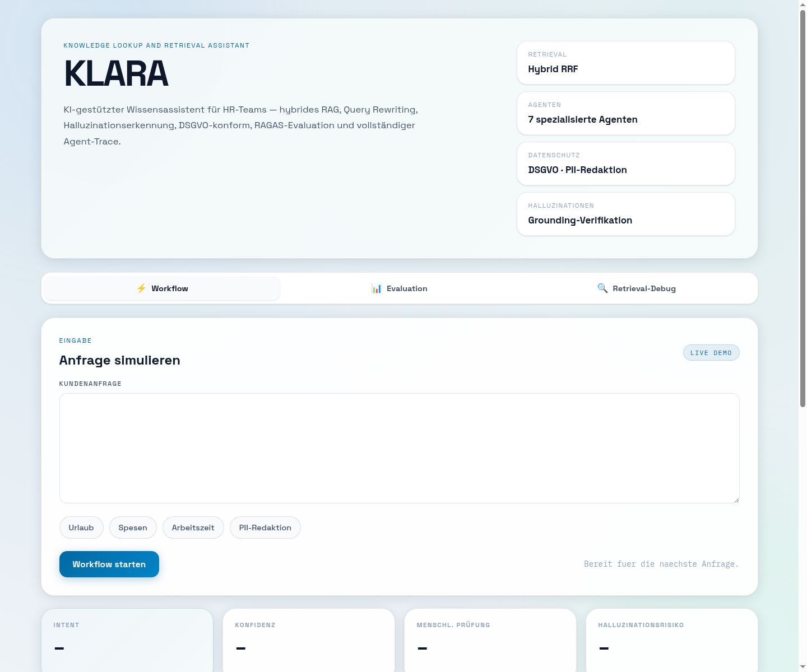
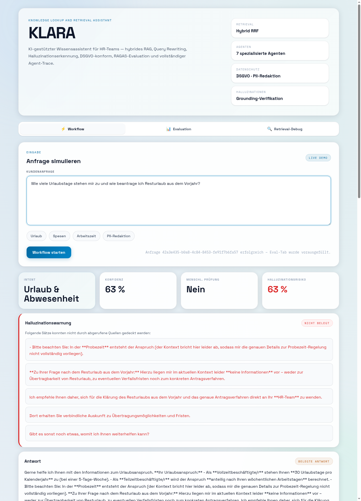

<div align="center">

# KLARA

**Knowledge Lookup And Retrieval Assistant**

KI-gestützter RAG-Wissensassistent für HR- und People-Operations-Teams —
produktionsreifer Python-Backend-Stack mit hybridem Retrieval, Halluzinationserkennung,
DSGVO-konformer PII-Redaktion und eingebautem Evaluierungssystem.

[](https://python.org)
[](https://fastapi.tiangolo.com)
[](https://anthropic.com)
[](https://github.com/ghostvenumai/klara-hr-rag/actions/workflows/ci.yml)
[](#datenschutz--dsgvo)

</div>

---

## Überblick

KLARA beantwortet Mitarbeiterfragen zu Urlaub, Gehalt & Spesen, Arbeitszeit, Onboarding
und Benefits — **ausschließlich auf Basis einer gepflegten Wissensdatenbank**. Jede Anfrage
durchläuft eine mehrstufige Agent-Pipeline, die transparent im Audit-Log nachvollziehbar ist.

Besonderes Merkmal: Der **GroundingVerifierAgent** prüft jede generierte Antwort Satz für
Satz gegen die abgerufenen Quellen und meldet ungedeckte Behauptungen als
Halluzinationsrisiko — ohne zusätzlichen LLM-Call, ohne Latenzkosten.

> Mitarbeiterdaten sind die sensibelsten Daten im Unternehmen. KLARA redigiert
> personenbezogene Daten (E-Mail, Telefon, IBAN, Sozialversicherungsnummer) **bevor**
> irgendetwas geloggt wird.

---

## Screenshots

### Übersicht


### Workflow mit Antwort, Konfidenz und Grounding-Verifikation


---

## Features

| Feature | Beschreibung |
|---|---|
| **Hybrid RRF Retrieval** | Lexikalische und Dense-Suche, fusioniert via Reciprocal Rank Fusion |
| **Query Rewriting** | Claude reformuliert Mitarbeiteranfragen für optimale Vektordatenbanksuche (löst HR-Kürzel wie bAV, AU, EZ auf) |
| **Contextual Retrieval** | Anthropic-Technik: Claude bereichert jeden Chunk mit Dokumentkontext vor dem Embedding |
| **Halluzinationserkennung** | Token-Overlap-Check je Satz — ohne Extra-LLM-Call |
| **PII-Redaktion** | E-Mail, Telefon, IBAN, Kreditkarte, Sozialversicherungsnummer werden vor dem Audit-Logging anonymisiert |
| **Intent-Klassifikation** | 6 HR-Intents (Urlaub, Gehalt, Arbeitszeit, On-/Offboarding, Benefits, DSGVO) steuern Eskalation und Antwortverhalten |
| **RAGAS-Evaluation** | Claude-Richter bewertet Faithfulness + Relevanz jeder Antwort |
| **SSE Streaming** | Token-by-Token Antwort via Server-Sent Events |
| **Multi-Turn History** | Gesprächsverlauf wird pro Request mitgeführt (max. 10 Turns) |
| **Agent Trace** | Jeder Pipeline-Schritt mit Latenz, Entscheidung und Begründung protokolliert |
| **Audit-Logging** | DSGVO-konformes JSONL-Log aller Anfragen (nur redigierte Eingaben) |
| **Offline-Fallback** | Ohne API-Keys: lokales Retrieval + Template-Antworten — voll testbar ohne Kosten |

---

## Architektur

```
POST /api/v1/ask
        │
        ▼
┌──────────────────────┐
│ IntentClassifier     │  6 HR-Intents, Keyword-basiert (kein LLM-Call)
├──────────────────────┤
│ PrivacyGuard         │  PII-Redaktion VOR jedem Logging (DSGVO)
├──────────────────────┤
│ QueryRewriter        │  Claude Haiku: Anfrage → optimale Suchquery
├──────────────────────┤
│ Retriever            │  Hybrid: lexikalisch + dense, RRF-Fusion, Top-K
├──────────────────────┤
│ ResponseComposer     │  Claude Opus: Antwort NUR aus abgerufenem Kontext
├──────────────────────┤
│ GroundingVerifier    │  Satz-für-Satz-Prüfung gegen Quellen (offline)
├──────────────────────┤
│ QualityGuard         │  Konfidenz-Score + Eskalation an Mensch (HITL)
├──────────────────────┤
│ Metrics              │  Latenz, Token-Kosten, Quellenzahl
└──────────────────────┘
        │
        ▼
  Antwort + Quellen + Trace + Audit-Log (redigiert)
```

Details: [docs/architecture.md](docs/architecture.md)

---

## API-Endpunkte

| Methode | Pfad | Beschreibung |
|---|---|---|
| `POST` | `/api/v1/ask` | Frage stellen — Antwort mit Quellen, Trace, Konfidenz |
| `POST` | `/api/v1/ask/stream` | Antwort als SSE-Stream (token-by-token) |
| `POST` | `/api/v1/ingest` | Dokumente zur Laufzeit in die Wissensdatenbank aufnehmen |
| `POST` | `/api/v1/eval/run` | RAGAS-Evaluation: Faithfulness + Relevanz per Claude-Richter |
| `GET`  | `/api/v1/debug/retrieval` | Retrieval-Diagnose: Rang, Score, Modus pro Chunk |
| `GET`  | `/api/v1/metrics` | Request-Zähler, Latenzen, Intent-Verteilung |
| `GET`  | `/api/v1/audit-logs` | DSGVO-konformes Audit-Log (nur redigierte Eingaben) |
| `GET`  | `/api/v1/health` | Health-Check inkl. Index-Status |

### Beispiel

```bash
curl -X POST http://localhost:8000/api/v1/ask \
  -H "Content-Type: application/json" \
  -d '{"question": "Wie viele Urlaubstage habe ich und was passiert mit Resturlaub?"}'
```

```json
{
  "intent": "leave_absence",
  "answer": "Vollzeitbeschäftigte haben 30 Urlaubstage pro Kalenderjahr. Resturlaub aus dem Vorjahr muss bis zum 31. März genommen werden...",
  "confidence": 0.87,
  "human_review": false,
  "hallucination_risk": 0.0,
  "sources": [{"title": "Urlaub Und Abwesenheit", "score": 0.41}],
  "redacted_input": "Wie viele Urlaubstage habe ich und was passiert mit Resturlaub?",
  "trace": [{"agent": "IntentClassifierAgent", "decision": "leave_absence", "latency_ms": 0.04}]
}
```

---

## Schnellstart

### Voraussetzungen

- Python 3.11+
- Anthropic API Key (optional — ohne Key läuft KLARA im Offline-Modus mit Template-Antworten)

### Installation

```bash
git clone https://github.com/ghostvenumai/klara-hr-rag.git
cd klara-hr-rag

make install        # Kern-Stack
make install-ai     # inkl. Anthropic + OpenAI Clients

cp .env.example .env   # Keys eintragen (optional)
make run               # http://localhost:8000
```

### Docker

```bash
docker compose up -d
```

### Tests

```bash
make test   # 20 Tests: Intents, PII-Redaktion, Retrieval, Workflow, API
```

---

## Wissensdatenbank

KLARA wird mit einer realistischen deutschen HR-Wissensdatenbank ausgeliefert
(14 Dokumente in `data/knowledge_base/`):

Urlaub & Abwesenheit · Krankmeldung · Arbeitszeit & Gleitzeit · Homeoffice ·
Gehalt & Abrechnung · Spesen & Reisekosten · Onboarding · Offboarding ·
Elternzeit & Mutterschutz · Benefits · Weiterbildung · Datenschutz ·
Arbeitsvertrag · IT & Arbeitsmittel

Eigene Dokumente: einfach als Markdown in `data/knowledge_base/` ablegen
(automatischer Index beim Start) oder zur Laufzeit via `POST /api/v1/ingest`.

---

## Datenschutz & DSGVO

- **PII-Redaktion vor Persistenz:** E-Mail, Telefon, IBAN, Kreditkarte und deutsche
  Sozialversicherungsnummer werden erkannt und durch `[REDACTED_*]` ersetzt, bevor
  die Eingabe das Audit-Log erreicht
- **Eskalation:** DSGVO-Auskunftsersuchen und sensible Anfragen werden automatisch
  als `human_review` markiert
- **Kein Roh-Logging:** Das JSONL-Audit-Log enthält ausschließlich redigierte Eingaben
- **On-Premise-fähig:** SQLite-freier Kern, lokale Embeddings als Fallback — keine
  Datenübertragung an Dritte erforderlich

---

## Tech Stack

| Komponente | Technologie |
|---|---|
| Backend | Python 3.11+ · FastAPI · Pydantic v2 (async) |
| LLM | Claude Opus 4.8 (Synthese) · Claude Haiku 4.5 (Query Rewriting) — mit Prompt Caching |
| Embeddings | OpenAI `text-embedding-3-small` · lokaler lexikalischer Fallback |
| Vector Store | In-Memory-Index · optional Supabase (pgvector) |
| Frontend | Vanilla JS Single-Page-Demo (kein Build-Schritt) |
| Tests | pytest · pytest-asyncio (20 Tests) |
| Deployment | Docker · docker-compose · Makefile |

---

## Architektur-Entscheidungen

1. **Halluzinationserkennung ohne LLM:** Token-Overlap je Satz statt LLM-Richter im
   Hot Path — deterministisch, kostenlos, < 1 ms. Der LLM-Richter (RAGAS) läuft
   bewusst nur offline im Evaluations-Endpoint.
2. **Graceful Degradation:** Jede externe Abhängigkeit (Claude, OpenAI, Supabase) hat
   einen lokalen Fallback. Das System bleibt ohne einen einzigen API-Key demonstrier-
   und testbar.
3. **PII-Redaktion als Pipeline-Schritt, nicht als Afterthought:** Der PrivacyGuard
   läuft als zweiter Agent — vor Retrieval, vor Logging, vor allem anderen.
4. **Trace-First-Design:** Jeder Agent gibt Entscheidung, Begründung und Latenz
   zurück. Erklärbarkeit ist bei HR-Anwendungen keine Kür, sondern Voraussetzung
   für Akzeptanz bei Betriebsrat und Datenschutzbeauftragten.

---

## Lizenz

MIT — frei verwendbar als Referenzarchitektur.

---

<div align="center">

Entwickelt von **Serkan · GhostVenumAI** — Freelance AI Engineering für den DACH-Markt

[](https://github.com/GhostVenumAI)

</div>
